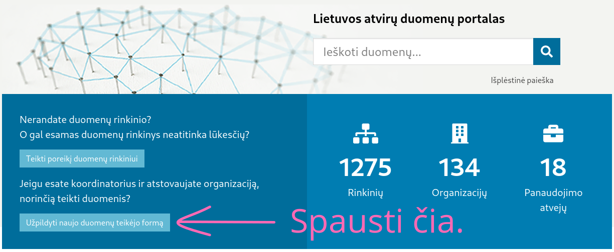
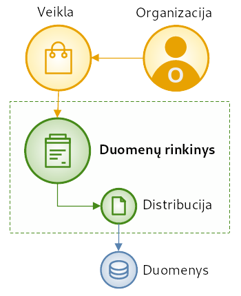
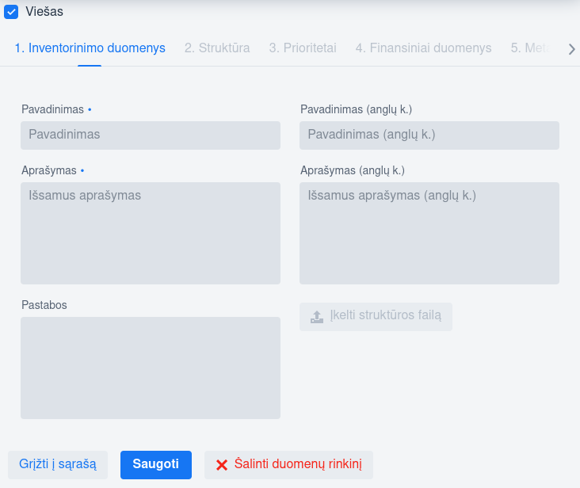
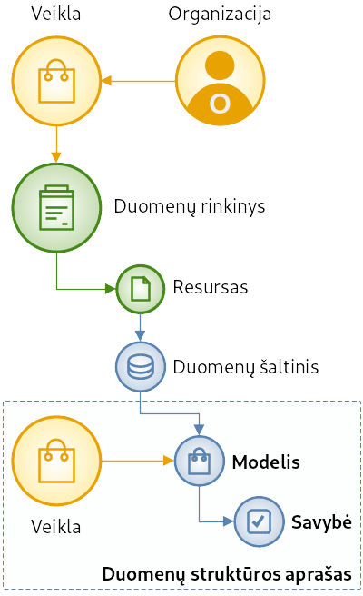

.. default-role:: literal

.. _atvėrimas:

Duomenų teikėjams
#################

Labai apibendrintai, kiekviena įstaiga atverianti duomenis turi atlikti šiuos
žingsnius:

.. image:: /static/zingsniai.png

|auto| *žymi dalinai arba pilnai automatizuotą proceso žingsnį.*

1. Paskirti atvirų duomenų koordinatorių ir `užsiregistruoti Portale`__.

   __ https://data.gov.lt/opening/learningmaterial/10

2. Sudaryti :ref:`duomenų rinkinių sąrašą <preliminari-inventorizacija>`
   ir publikuoti jį :term:`Portale <ADK>`.

3. Parengti :ref:`duomenų struktūros aprašus <detali-inventorizacija>` ir
   paskelbti juos :term:`Portale <ADK>`.

4. :ref:`Atverti duomenis <duomenų-atvėrimas>` savarankiškai, su rangovo arba
   Vyriausybės įgaliotos institucijos pagalba.

Visas duomenų atvėrimo procesas duomenų teikėjams yra kiek įmanoma
supaprastintas ir iš esmės susivedantis į duomenų rinkinių sąrašo ir struktūros
aprašų parengimą. Visos kitos techninės duomenų nuskaitymo, transformavimo,
atvėrimo ir publikavimo veiklos yra arba automatizuotos arba jas atlieka
paskirtos atsakingos įstaigos.

Duomenų teikėjams, atveriant duomenis pagalbą teikia šios įstaigos:

Informacinės visuomenės plėtros komitetas (IVPK)
    - Prižiūri visą šalies duomenų atvėrimo procesą ir konsultuoja duomenų
      teikėjus visais klausimais susijusiais su duomenų atvėrimu.

    - Prižiūri atvirų duomenų :term:`Katalogą <ADK>`, kuriame vienoje vietoje
      skelbiami visi atverti ar planuojami atverti duomenys ir vieno langelio
      principu priimami prašymai gauti duomenis iš duomenų naudotojų.

    - Prižiūri atvirų :ref:`duomenų publikavimo Saugyklą <saugykla>`, kurioje
      duomenys publikuojami laikantis geriausių duomenų teikimo praktikų,
      suteikiama galimybė duomenis publikuoti aukščiausiu brandos lygiu.

    - Kuria ir palaiko :ref:`technines priemones <spinta>` leidžiančias duomenis
      atverti automatizuotu būdu. Šios priemonės yra laisvai ir nemokamai
      teikiamos visiems duomenų teikėjams atveriantiems duomenis.

    - Vykdo :ref:`standartų, protokolų ir techninių dokumentacijų priežiūrą
      <dsa>`, kad duomenų atvėrimo procese dalyvaujančios šalys ir naudojami
      komponentai galėtų susišnekėti tarpusavyje.

    - Rengia mokymus ir mokomąją medžiagą tiek atvirų duomenų teikėjams apie
      duomenų atvėrimą, tiek naudotojams apie atvertų duomenų naudojimą.

Vyriausybės įgaliota institucija (Statistikos departamentas)
    - Teikia duomenų atvėrimo paslaugą, naudojant automatizuotas duomenų
      atvėrimo priemones.

Paklausa grįstas duomenų atvėrimas
==================================

.. image:: /static/paklausa.png
    :align: right

Paskelbus rinkinių sąrašus, kiti žingsniai daromi esant poreikiui atverti
duomenis arba savo nuožiūra įvertinus duomenų paklausos potencialą.

Paklausa grįstas duomenų atvėrimas reiškia, kad duomenų tiekėjai iš pradžių
parengia atvertinų duomenų rinkinių sąrašus (1), kad juos galėtų rasti duomenų
naudotojai (2). Realus duomenų atvėrimo procesas pradedamas tuomet, kai duomenų
naudotojai, rade jiems reikalingus duomenų rinkinius pateikia prašymą (3) juos
gauti. Teikėjai gavę prašymus atverti duomenis, pradeda duomenų atvėrimo
procesą parengdami duomenų struktūros aprašus (4), kurių pagrindu vykdomas
duomenų atvėrimas (5). Galiausiai, atvėrus duomenis, naudotojai gauna tai, ko
prašė (6).

Duomenų teikėjai, savo nuožiūra, įvertinę duomenų paklausos potencialą gali
pradėti duomenų atvėrimą ir negavę prašymo.

.. _koordinatoriaus-registracija:

Koordinatoriaus registracija
============================

Kiekviena duomenis atverianti įstaiga pirmiausia turi paskirti vieną žmogų
atsakingą už duomenų atvėrimo koordinavimą. Šis žmogus bus atsakingas už
įstaigos duomenų atvėrimo organizavimą, atsakys į duomenų naudotojų
paklausimus pateiktus per atvirų duomenų portalą, išsiaiškins kokius duomenis
įstaiga valdo ir kas atsakingas už jų priežiūrą.

Koordinatorius darbui su atvirais duomenimis gali pasitelkti tvarkytojus,
kurie būtų atsakingi už atskirų duomenų rinkinių tvarkymą.

Atvirų duomenų koordinatorius neprivalo turėti techninių duomenų valdymo
kompetencijų, tačiau tokių kompetencijų turėjimas būtų privalumas.

Koordinatoriaus paskyrimas įteisinamas į atvirų duomenų portalą pateikianti
įstaigos vadovo pasirašytą `raštą`__.

__ https://data.gov.lt/opening/learningmaterial/10

Turint įstaigos vadovo pasirašytą raštą, paskirtasis koordinatorius
`registruojasi atvirų duomenų portale`__.

__ https://data.gov.lt/

Koordinatorius registruoja valstybės įstaigos ir jų valdomos įmonės. Savo
koordinatorius gali registruoti ir privataus sektoriaus atstovai, jei
publikuoja atvirus duomenis ir nori, kad jie būtų randami Lietuvos ir Europos
atvirų duomenų portaluose.

.. _inventory:

Metaduomenys
============

Metaduomenų rengimas susideda iš dviejų dalių:

- :ref:`Duomenų rinkinių sąrašo sudarymas <preliminari-inventorizacija>`,

- :ref:`Duomenų struktūros aprašų parengimas <detali-inventorizacija>`.

Duomenų struktūros aprašų parengimas yra pati sudėtingiausia dalis, todėl
rekomenduojama pirmiausiai susidaryti rinkinių sąrašus, o po to esant realiam
duomenų poreikiui, pereiti prie duomenų struktūros aprašų.

.. _preliminari-inventorizacija:

Rinkinių sąrašas
================

Įstaigos paskirtas koordinatorius apžvelgia įstaigos veiklos nuostatus, valdomas
informacines sistema, registrus, jau atvertus duomenis ir sudaro įstaigos
valdomų :term:`duomenų rinkinių <duomenų rinkinys>` sąrašą.

Šiame etape svarbiausiai gerai suprasti kas yra duomenų rinkinys ir
distribucija.

**Duomenų rinkinys** yra grupė duomenų reikalingų tam tikrai organizacijos
veiklai vykdyti. Duomenų rinkinys apibrėžia duomenų autorystę ir veiklos pobūdį
kurioje naudojami duomenys.

**Distribucija** yra fizinė duomenų rinkinio išraiška, pavyzdžiui duomenų bazė,
skaičiuoklės lentelė, katalogas, kuriame laikomi dokumentai ir pan.

Kadangi organizacijų veikloms reikalingi duomenys dažniausiai saugomi tam
tikroje vietoje, tai sudarant duomenų rinkinių sąrašą paprasčiausia apžvelgti
resursus naudojamus duomenų saugojimui ir pagal tai įvardinti duomenų rinkinius.

Atvirų duomenų portale, naujas duomenų rinkinys registruojamas užpildžius šią
formą:

Rekomenduotina rinkinių sąrašus sudaryti tiesiogiai :term:`atvirų duomenų
portale <ADK>`, tačiau yra galimybė parengti `rinkinių sąrašo lentelę`__ ir ją
vėliau importuoti į :term:`portalą <ADK>`.

__ https://data.gov.lt/opening/learningmaterial/14

Sudarant rinkinių sąrašus, reikėtų vadovautis principu, kad visi duomenys,
kuriems nėra taikomi apribojimai yra atviri.

Inventorizacijos metu, pateikiami dalis tik metaduomenų, kurie yra reikalingi,
kad duomenų rinkinius būtų galima surasti atvirų duomenų portale. Kita
metaduomenų dalis susijusi su atvertų duomenų periodiškumu, licencija ir
naudojimo sąlygomis pateikiama po to, kai yra priimtas sprendimas atverti
duomenis.

.. _detali-inventorizacija:

Duomenų struktūros aprašas
==========================

Duomenų struktūros aprašas rengiamas tada, kai atsiranda prašymas atverti
duomenis arba savo nuožiūra įvertinus duomenų paklausos potencialą.

Duomenų struktūros apraše pateikiama duomenų struktūros išklotinė išvardinant
visus duomenų laukus, kurie bus atverti.

Duomenų struktūros apraše pateikiama pilna duomenų laukų išklotinė.

Duomenų laukai yra skirstomi į modelius. **Modelio** ir **savybės** tiksli
prasmė priklauso nuo aprašomo duomenų šaltinio:

========  =======  =========
Šaltinis  Modelis  Savybė
========  =======  =========
SQL       Lentelė  Stulpelis
CSV       Lentelė  Stulpelis
XLSX      Lentelė  Stulpelis
JSON      Masyvas  Atributas
XML       Masyvas  Atributas
RDF       Klasė    Savybė
========  =======  =========

Duomenų struktūros apraše galima aprašyti įvairių duomenų šaltinių turinį
vieningu sutartiniu būdu.

Duomenų struktūros aprašo rengimas susideda iš tokių žingsnių:

1. Duomenų šaltinio administratorius pateikia šaltinio :ref:`duomenų struktūros
   išklotinę (ŠDSA) <dsa>`.

2. Duomenų srities ekspertai su duomenų šaltinio administratoriaus pagalba
   pateikia trūkstamus metaduomenis duomenų struktūros aprašo lentelėje.

Jei pirminio duomenų struktūros aprašo varianto sugeneruoti iš duomenų
šaltinio neįmanoma, pavyzdžiui, jei duomenys yra labai žemo brandos lygio,
tuomet duomenų struktūros aprašas pildomas nuo nulio naudojant :download:`aprašo
lentelės šabloną </static/sablonai/dsa.xlsx>`.

Duomenų struktūros aprašas yra lentelė susidedanti iš 15 stulpelių, kuriuose
aprašoma duomenų struktūra. Tarkime, turint tokius duomenis:

====  ========  =======  ===============
ŠALIS
----------------------------------------
ID    KODAS     ŽEMYNAS  ŠALIS
====  ========  =======  ===============
1     lt        eu       Lietuva
2     lv        eu       Latvija
3     ee        eu       Estija
====  ========  =======  ===============

Duomenų struktūra aukšiau pateiktiems duomenims atrodys taip:

.. table:: Duomenų struktūros aprašas

    +----+---+---+---+---+------------+---------+-------+------------+----------------+-------+---------+-----+-------+-------------+
    | id | d | r | b | m | property   | type    | ref   | source     | prepare        | level | access  | uri | title | description |
    +====+===+===+===+===+============+=========+=======+============+================+=======+=========+=====+=======+=============+
    |    | datasets/example/countries |         |       |            |                |       |         |     |       |             |
    +----+---+---+---+---+------------+---------+-------+------------+----------------+-------+---------+-----+-------+-------------+
    |    |   | salys                  | sql     |       | \sqlite:// |                |       |         |     |       |             |
    +----+---+---+---+---+------------+---------+-------+------------+----------------+-------+---------+-----+-------+-------------+
    |    |   |   |   | Country        |         | id    | ŠALIS      | continent="eu" |       |         |     |       |             |
    +----+---+---+---+---+------------+---------+-------+------------+----------------+-------+---------+-----+-------+-------------+
    |    |   |   |   |   | id         | integer |       | ID         |                | 4     | private |     |       |             |
    +----+---+---+---+---+------------+---------+-------+------------+----------------+-------+---------+-----+-------+-------------+
    |    |   |   |   |   | code       | string  |       | KODAS      |                | 2     | open    |     |       |             |
    +----+---+---+---+---+------------+---------+-------+------------+----------------+-------+---------+-----+-------+-------------+
    |    |   |   |   |   | continent  | string  |       | ŽEMYNAS    |                | 2     | private |     |       |             |
    +----+---+---+---+---+------------+---------+-------+------------+----------------+-------+---------+-----+-------+-------------+
    |    |   |   |   |   | name       | string  |       | ŠALIS      |                | 2     | open    |     |       |             |
    +----+---+---+---+---+------------+---------+-------+------------+----------------+-------+---------+-----+-------+-------------+

.. note::

    Siekiant padidinti duomenų struktūros aprašo lentelės skaitomumą, kai
    kurie stulpelių pavadinimai yra sutrumpinti:

    | **d** - dataset - duomenų rinkinio kodinis pavadinimas.
    | **r** - resource - duomenų šaltinio kodinis pavadinimas.
    | **b** - base - modelio bazės kodinis pavadinimas.
    | **m** - model - modelio kodinis pavadinimas.

Duomenų struktūros aprašo lentelė susideda iš :ref:`5 dimensijų
<dimensijos-stulpeliai>` (dataset, resource, base, model, property) ir :ref:`9
metaduomenų stulpelių <metaduomenų-stulpeliai>`, kurių prasmė priklauso nuo
vienos iš 5 dimensijų.

.. image:: /static/dsa.png
    :align: center

Plačiau apie tai, ką reiškia kiekvienas stulpelis galite skaityti skyriuje
:ref:`dsa-lentelės-struktūra`.

:term:`ŠDSA` lentelėje reikia pateikti tokius duomenis:

.. image:: /static/dsa-pildymas.png
    :align: center

1. :ref:`Duomenų rinkiniui <dataset>` suteikti :ref:`kodinį pavadinimą
   <kodiniai-pavadinimai>`.

2. Pateikti duomenų šaltinio pavadinimą, :ref:`tipą ir adresą <resource>`.

3. Užpildyti :data:`uri` stulpelį, nurodant kuriose vietose yra :ref:`asmens
   duomenys <pii>`.

4. Užpildyti :data:`property.access`, nurodant duomenų :ref:`prieigos lygį
   <access>`.

5. Užpildyti :data:`model.prepare`, jei duomenys atveriami ne pilna apimtimi ir
   reikia juos :ref:`filtruoti <duomenų-atranka>`.

6. :data:`property.level` stulpelyje nurodyti esamą duomenų laukų :ref:`brandos
   lygį <level>`.

7. Užpildyti :data:`title` ir :data:`description` stulpelius pateikiant
   :data:`model` ir :data:`property` pavadinimus ir aprašymus.

Galiausiai, toks duomenų struktūros aprašas gali būti naudojamas
:ref:`automatizuotam duomenų atvėrimui ir publikavimui
<automatinis-atvėrimas>` arba naudojamas kaip sutarties priedas, jei įstaiga
duomenis atveria su rangovo ar Vyriausybės paskirtos įstaigos pagalba.

Jei įstaiga jau yra atvėrusi duomenis ir juos publikuoja savo infrastruktūroje,
tuomet į atvirų duomenų portalą turi būti įkeliamas, ne :term:`ADSA`, o
:term:`ŠDSA`, kuriame aprašyti įstaigos infrastruktūroje publikuojami duomenys.

.. _duomenų-atvėrimas:

Duomenų atvėrimas
=================

Kiekviena įstaiga renkasi vieną iš šių duomenų atvėrimo variantų:

- Atveria savarankiškai, jei turi vidinius IT resursus.

- Atveria su rangovo pagalba, jei neturi vidinių IT resursų, bet turi
  paslaugų teikimo sutartis su išoriniu rangovu.

- Atveria su Vyriausybės įgaliotos institucijos (Statistikos departamento)
  pagalba, jei neturi nei vidinių IT resursų, nei išorinio rangovo.

Nepriklausomai nuo pasirinkto varianto, duomenų struktūros variantas
naudojamas, kaip techninė specifikacija ar sutarties priedas, kuriame
tiksliai įvardinta kurie duomenys yra atveriami.

Standartizuota duomenų struktūros aprašo forma, leidžia :ref:`automatizuoti
techninę duomenų atvėrimo dalį <automatinis-atvėrimas>`.

Savarankiškas atvėrimas
-----------------------

Atveriant duomenis savarankiškai įstaiga turi tokius variantus:

- Duomenis atveria naudojantis :ref:`automatizuoto duomenų atvėrimo priemonėmis
  <spinta>`.

- Duomenis atveria savo priemonėmis, tačiau atveriamus duomenis publikuoja per
  :ref:`API <saugykla>` į :term:`atvirų duomenų saugyklą <ADS>`.

- Duomenis jau yra atvėrusi arba duomenis atveria savo priemonėmis ir
  publikuoja savo infrastruktūroje.

Nepriklausomai nuo pasirinkto varianto, įstaiga turi :ref:`pilnai parengti
metaduomenis <inventory>`.

Atvėrimas per rangovą
---------------------

Atvėrimas vyksta taip pat, kaip ir savarankiškai, tik naudojantis išorinio
rangovo paslaugomis.

Su rangovu sudarant sutarti, kaip sutarties priedas turi būti pateikiamas
duomenų struktūros aprašas, kuriame tiksliai nurodyta kokius duomenis reikia
atverti.

Atvėrimas per Statistikos departamentą
--------------------------------------

Visoms įstaigos, kurios neturi vidinių resursų ar nėra pajėgios pačios atverti
duomenų, Vyriausybė yra paskyrusi atsakingą instituciją, Statistikos
departamentą.

Jei duomenys atveriami per Statistikos departamentą, tuomet įstaiga su
Statistikos departamentu sudaro duomenų atvėrimo paslaugos teikimo sutartį,
prie kurios, kaip priedas pateikiamas atveriamų duomenų struktūros aprašas.

Statistikos departamentas numatytu periodiškumu pasidarys visų duomenų kopiją
(prie kurių yra suteikta prieiga) į Valstybės Duomenų Valdysenos Informacinę
Sistemą (VDVIS).

Vadovaujantis duomenų struktūros apraše pateikta informacija ir naudojantis
VDVIS funkcionalumu, atliks nuasmeninimą, kitas reikalingas transformacijas ir
publikuos duomenis per :term:`atvirų duomenų saugyklą <ADS>`.

.. |auto| image:: /static/icons/auto.png
