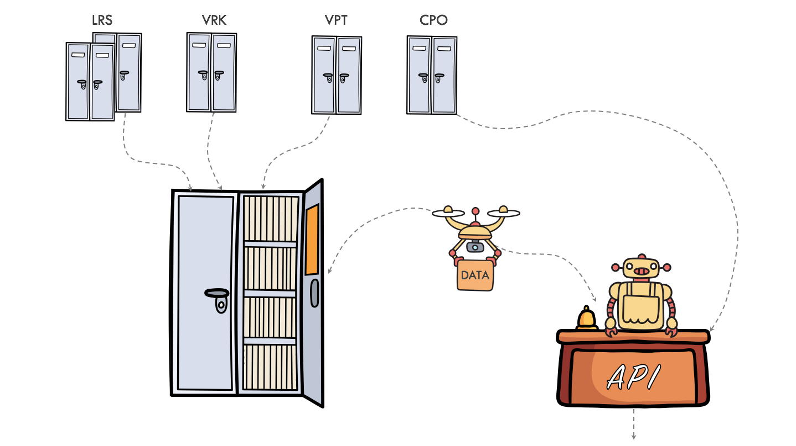
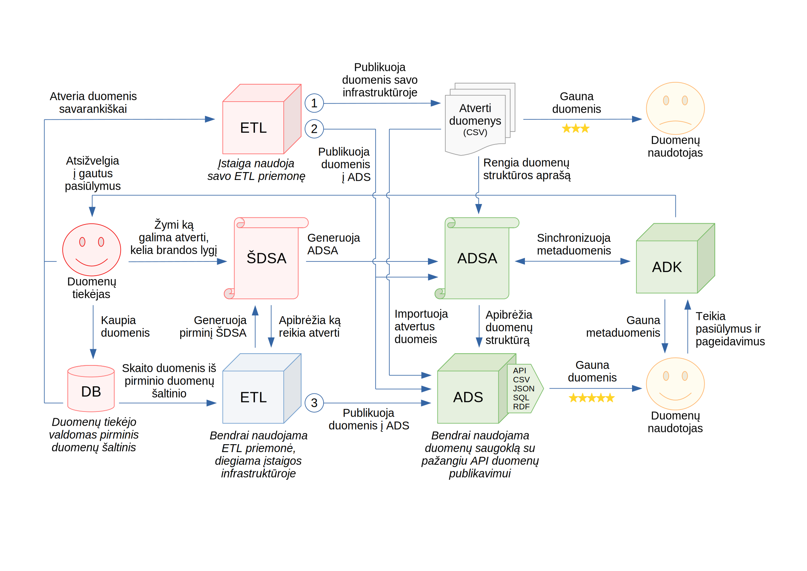

.. default-role:: literal

Duomenų atvėrimo vadovas
########################

Lietuvos :term:`atvirų duomenų kataloge <ADK>` (ADK) publikuojami atvirų duomenų
rinkinių metaduomenys. Viena iš ADK publikuojamų metaduomenų sudedamoji dalis
yra :term:`duomenų struktūros aprašo (DSA) <DSA>` lentelė. Atveriant duomenis,
daugeliu atveju turėtu užtekti parengti :term:`DSA` lentelę, o visa kita duomenų
atvėrimo veikla daroma naudojant automatizuotas priemones. Todėl šiame duomenų
atvėrimo vadove didžiausias dėmesys skiriamas :term:`DSA` lentelių
dokumentavimui.

DSA lentelėse pateikti metaduomenys naudojami duomenų kokybės tikrinimui,
duomenų atvėrimui iš pirminių duomenų šaltinių, duomenų importavimui į bendrą
duomenų saugyklą iš kurios duomenys teikiami įvairiais formatais, su galimybe
jungti duomenis tarpusavyje ar gauti duomenis įvairiais pjūviais naudojant
lankstų API.

Šis vadovas skirtas tiek įstaigoms ar įmonėms atveriančioms duomenis, tiek
duomenų naudotojams, naudojantiems atvertus duomenis.

Vadove rasite informaciją, apie tai, kaip rengti :term:`DSA` lenteles, kaip
naudotis priemonėmis veikiančiomis su :term:`DSA` lentelėmis ir kaip naudotis
duomenų publikavimo API.

.. warning::

    Atkreipkite dėmesį, kad šis vadovas ir minėtos priemonės yra aktyvaus
    vystymo stadijoje. Tačiau pats :ref:`DSA <spec>` lentelės formatas yra
    stabilus ir didesnių lentelės formato pakeitimų daryti nenumatoma, todėl
    duomenų struktūras galima aprašinėti jau dabar, o įrankiai ir dokumentacija
    bus pilnai parengti iki antrojo lietuvos duomenų atvėrimo etapo pabaigos,
    2023 metais.

Dokumentacija sudaryta iš šių esminių dalių:

- Informacija duomenų tiekėjams apie tai, kaip atlikti turimų duomenų
  :ref:`inventorizaciją <inventory>` ir inventorizuotų duomenų :ref:`brandos
  lygio kėlimą <brandos-lygio-kėlimas>`.

- Informacija diegėjams apie tai, kaip diegti ir konfigūruoti :ref:`priemones
  <priemonės>` skirtas darbui su duomenimis ir :term:`DSA` lentelėmis.

- Informacija duomenų naudotojams, apie tai, kaip :ref:`teikti pageidavimus
  ir pastabas <poreikio-deklaravimas>` dėl duomenų ir kaip :ref:`gauti pačius
  duomenis <api>`.

- :ref:`Techninė duomenų struktūros aprašo specifikacija <spec>`, kurioje rasite
  detalią informaciją apie tai kaip rašyti ir skaityti :term:`DSA` lenteles.

Duomenų atvėrimo procesas
=========================

.. _process-overview:

Toliau, trumpai aptarsime visą duomenų :ref:`atvėrimo procesą
<process-overview>`, nagrinėjant vieną konkretų pavyzdį.

Įstaigos atveriančios duomenis renkasi vieną iš šių galimų duomenų atvėrimo
proceso variantų:

1. Atveria ir publikuoja duomenis savarankiškai, parengia :term:`ADSA`.

2. Atveria duomenis savarankiškai, pagal parengtą :term:`ADSA`, tačiau pačius
   duomenis publikuoja per centralizuotą saugyklą.

3. Atlieka turimų duomenų inventorizaciją parengiant :term:`ŠDSA` kurio
   pagrindu gaunamas :term:`ADSA`, o duomenys atveriami automatizuotu būdu
   naudojant bendrai naudojamas ir vystomas priemones.

Nepriklausomai nuo to kokį duomenų atvėrimo procesą pasirenka įstaigos,
visais atvejais būtina į :term:`ADK` pateikti :term:`ADSA` lentelę, kurios
dėka visi duomenys galiausiai patenka į vieną bendrą duomenų saugyklą.

Inventorizacija
---------------

Manifesto sudarymo procesas vadinamas duomenų :ref:`inventorizacija
<inventory>`. Kiekviena įstaiga atliekanti savo kaupiamų duomenų inventorizaciją
aprašo turimų duomenų metaduomenis :term:`DSA` lentelėse. Tarkime, kaip pavyzdį,
galime panagrinėti išgalvotos įstaigos „Duomenų centras“ sutrumpintai vadinamos
DC duomenis. DC duomenų bazėje yra lentelė techniniu pavadinimu `COUNTRIES`,
lentelės turinys atrodo taip:

=======  ========  ===========
COUNTRIES
------------------------------
ID       CODE      COUNTRY
=======  ========  ===========
1        lt        Lietuva
2        lv        Latvija
3        ee        Estija
=======  ========  ===========

Įstaiga „Duomenų centras“ nori atverti duomenis. Pirmas žingsnis būtų duomenų
inventorizacija. Pirmas inventorizacijos žingsnis yra preliminaraus duomenų
rinkinių sąrašo sudarymas. Tačiau norint atlikti pilną inventorizaciją reikia
:term:`DSA` lentelėje aprašyti ir duomenų struktūras. Duomenų inventorizacijos
metu sudaromi įstaigoje esančių :term:`duomenų modelių <modelis>` ir jų
:term:`savybių <savybė>` sąrašas, kuris :term:`DSA` lentelėje atrodo taip:

+----+---+---+---+---+-----------+---------+------+-----------+-------+
| id | d | r | b | m | property  | type    | ref  | source    | level |
+====+===+===+===+===+===========+=========+======+===========+=======+
|  1 | datasets/gov/dc/countries |         |      |           |       |
+----+---+---+---+---+-----------+---------+------+-----------+-------+
|  2 |   | db                    | sql     |      |           |       |
+----+---+---+---+---+-----------+---------+------+-----------+-------+
|  3 |   |   |   | countries     |         | id   | COUNTRIES |       |
+----+---+---+---+---+-----------+---------+------+-----------+-------+
|  4 |   |   |   |   | id        | integer |      | ID        | 4     |
+----+---+---+---+---+-----------+---------+------+-----------+-------+
|  5 |   |   |   |   | code      | string  |      | CODE      | 2     |
+----+---+---+---+---+-----------+---------+------+-----------+-------+
|  6 |   |   |   |   | name      | string  |      | COUNTRY   | 2     |
+----+---+---+---+---+-----------+---------+------+-----------+-------+

Tokią pirminę inventorizacijos lentelę daugeliu atveju galima generuoti
automatiškai iš duomenų šaltinio.

Deja ne viską galima automatizuoti, toliau prasideda rankinis darbas su
lentele:

- :data:`access` stulpelyje surašomas duomenų prieinamumas,

- :data:`level` stulpelyje tikslinamas duomenų brandos lygis,

- :data:`ref` stulpelyje įvardinami :term:`objektų <objektas>` identifikatoriai,

- esant poreikiui, keičiami :data:`model` ir :data:`property` pavadinimai.

Galiausiai užbaigus inventorizaciją, gausime tokią :term:`ŠDSA` lentelę:

+----+---+---+---+---+-----------+---------+------+-----------+-------+---------+
| id | d | r | b | m | property  | type    | ref  | source    | level | access  |
+====+===+===+===+===+===========+=========+======+===========+=======+=========+
|  1 | datasets/gov/dc/countries |         |      |           |       |         |
+----+---+---+---+---+-----------+---------+------+-----------+-------+---------+
|  2 |   | db                    | sql     |      |           |       |         |
+----+---+---+---+---+-----------+---------+------+-----------+-------+---------+
|  3 |   |   |   | countries     |         | id   | COUNTRIES |       |         |
+----+---+---+---+---+-----------+---------+------+-----------+-------+---------+
|  4 |   |   |   |   | id        | integer |      | ID        | 4     | private |
+----+---+---+---+---+-----------+---------+------+-----------+-------+---------+
|  5 |   |   |   |   | code      | string  |      | CODE      | 3     | open    |
+----+---+---+---+---+-----------+---------+------+-----------+-------+---------+
|  6 |   |   |   |   | name      | string  |      | COUNTRY   | 3     | open    |
+----+---+---+---+---+-----------+---------+------+-----------+-------+---------+

Baigus inventorizacija, :term:`ŠDSA` lentelė konvertuojama į :term:`ADSA`
lentelę. :term:`ADSA` lentelė publikuojama :term:`ADK` duomenų naudotojų
susipažinimui, dar neatvėrus duomenų.

Brandos lygio kėlimas
---------------------

Duomenų naudotojai :term:`ADK` svetainėje gali :ref:`pasisakyti
<poreikio-deklaravimas>` kokie duomenys jiems labiausiai aktualūs, taip
formuodami duomenų atvėrimo ir brandos lygio kėlimo prioritetus.

Bendradarbiaujant ir atsižvelgiant į duomenų naudotojų atsiliepimus, tęsiamas
darbas su :term:`ŠDSA` lentele, :ref:`keliant duomenų brandos lygį
<brandos-lygio-kėlimas>`. Baigus duomenų brandos lygio kėlimo darbus gauname dar
pilnesnę ir išsamesnę :term:`ŠDSA` lentelę, kuri atrodo taip:

+----+---+---+---+---+-----------+---------+------+-----------+------+---------+------------------------------------+--------------+-----------------+
| id | d | r | b | m | property  | type    | ref  | source    |level | access  | uri                                | title        | description     |
+====+===+===+===+===+===========+=========+======+===========+======+=========+====================================+==============+=================+
|  8 |   |   |   |   |           | prefix  | esco |           |      |         | \http://data.europa.eu/esco/model# |              |                 |
+----+---+---+---+---+-----------+---------+------+-----------+------+---------+------------------------------------+--------------+-----------------+
|  9 |   |   |   |   |           | prefix  | og   |           |      |         | \http://ogp.me/ns#                 |              |                 |
+----+---+---+---+---+-----------+---------+------+-----------+------+---------+------------------------------------+--------------+-----------------+
|  1 | datasets/gov/dc/countries |         | 1    |           |      |         |                                    |              |                 |
+----+---+---+---+---+-----------+---------+------+-----------+------+---------+------------------------------------+--------------+-----------------+
|  2 |   | db                    | sql     |      |           |      |         |                                    |              |                 |
+----+---+---+---+---+-----------+---------+------+-----------+------+---------+------------------------------------+--------------+-----------------+
|  7 |   |   | /esco/country     |         | code |           |      |         |                                    |              |                 |
+----+---+---+---+---+-----------+---------+------+-----------+------+---------+------------------------------------+--------------+-----------------+
|  3 |   |   |   | countries     |         | id   | COUNTRIES |      |         | esco:Country                       | Šalis        |                 |
+----+---+---+---+---+-----------+---------+------+-----------+------+---------+------------------------------------+--------------+-----------------+
|  4 |   |   |   |   | id        | integer |      | ID        | 4    | private |                                    |              |                 |
+----+---+---+---+---+-----------+---------+------+-----------+------+---------+------------------------------------+--------------+-----------------+
|  5 |   |   |   |   | code_a2   | string  |      | CODE      | 3    | open    | esco:isoCountryCodeA2              | Šalies kodas | Dviejų simbolių |
|    |   |   |   |   |           |         |      |           |      |         |                                    |              | šalies kodas    |
+----+---+---+---+---+-----------+---------+------+-----------+------+---------+------------------------------------+--------------+-----------------+
|  6 |   |   |   |   | name      | string  |      | COUNTRY   | 3    | open    | og:country-name                    | Pavadiniams  |                 |
+----+---+---+---+---+-----------+---------+------+-----------+------+---------+------------------------------------+--------------+-----------------+

Atnaujinus :term:`ŠDSA` lentelę, atnaujinama ir :term:`ADSA` lentelė, kuri
yra viešai publikuojama :term:`ADK` svetainėje. Kadangi :term:`ŠDSA` lentelė
gali turėti konfidencialios informacijos, ji nėra viešinama.

Galiausiai, baigus metaduomenų paruošimo darbus, atveriami duomenys naudojant
automatizuotas duomenų atvėrimo priemones, veikiančias :term:`DSA` lentelių
pagrindu. Atvėrus duomenis, dar kartą atnaujinama :term:`ADSA` lentelė papildant
ją informacija apie šaltinį, kuriame publikuojami atverti duomenys, o taip pat
atnaujinami ir :term:`ADK` metaduomenys.

Praktiškai visos duomenų atvėrimo veiklos yra automatizuojamos, išskyrus
:term:`DSA` lentelių rengimą, priemonių diegimą ir konfigūravimą.

Duomenų naudojimas
==================

Baigus duomenų atvėrimo darbus, didelė dalis duomenų bus importuojami į vieną
centralizuotą duomenų saugyklą, kurioje duomenys bus teikiam įvairiais
formatais, per lankstų API. API suteikia galimybę ne tik gauti duomenis
įvairiais formatais, bet juos filtruoti, apjungti ir atlikti kitas operacijas
su duomenimis.

Kartu su duomenimis teikiama ir duomenų schemos dokumentacija, generuojama iš
:term:`DSA` lentelių :data:`title` ir :data:`description` stulpeliuose pateiktos
informacijos.

Duomenis galima naudoti tiesiogiai per API, atsisiųsti visus duomenis vienu
kartu ar susikurti savo duomenų saugyklos veidrodį, nuolat sinchronizuojant
visus pasikeitimus iš centrinės duomenų saugyklos.

Kad būtų lengviau suprasti, kaip naudoti duomenis, pateikiamos pavyzdinės
užklausos.

Turinys
=======

.. toctree::
   :maxdepth: 2

   inventory
   demand
   maturity
   sources
   norm
   params
   vocabulary
   formulas
   api
   spec
   glossary
   contributing
